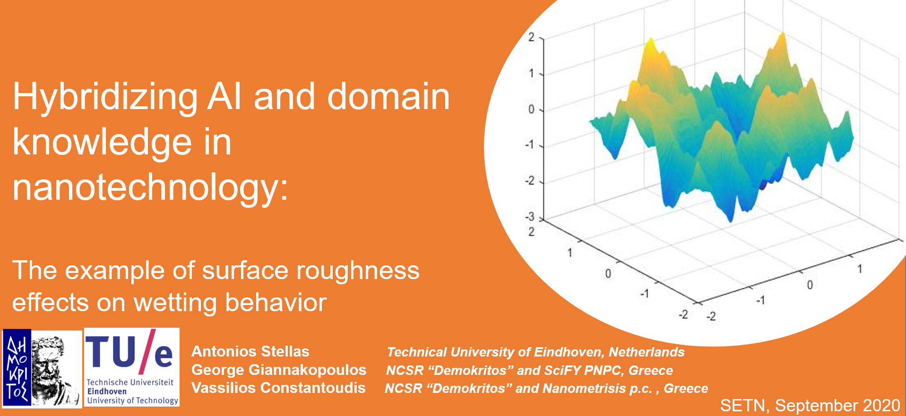
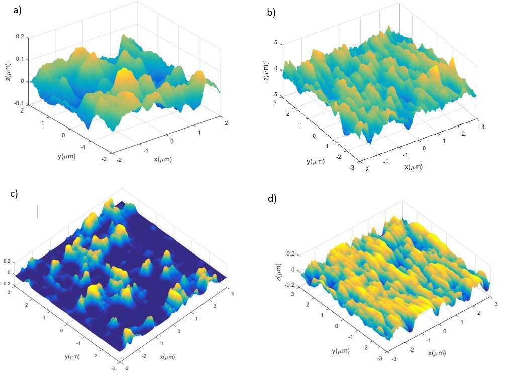

{:height="50%" width="50%"}
Format: 

# Hybridizing AI and domain knowledge in nanotechnology: The example of surface roughness effects on wetting behaviour
### Paper thesis repository.   :tada: 

## 1) Short Description
This repository contains Data and the Machine Learning results notebook from our paper.
We use Linear regression, Random Forest, Neural Network and Deep Neural network models to predict the active area of a surface from a set of paramters that describe rough surfaces. The generation of surfaces and thus, the dataset is not shared here.

## 2) Background

 The key ideas of our work are:  a)to use properly designed modeling results to train AI methods along with ex-perimental results, when they are available and b) to exploit the ability of ML techniques to reverse input and output so that the targeted design dictates the choice of nanostructure geometry and manufacturing conditions.  In this paper,we will focus on the first idea and we will apply it to evaluate the success of AI techniques to predict the relationship between nanosurface morphology and wettability.  We consider surfaces with Gaussian or non-Gaussian height distributions which are characterized by their first moments (rms, skewness, kurtosis)and the correlation lengths along x and y-axes.  Regarding wettability, we will assume the Wenzel scenario where the critical parameter for contact angle de-termination is the roughness ratior, defined as the ratio of true area of the solid surface to the apparent (projected) area .  The modeling between roughness parameters and ratio will be based on an inverse FFT-based method for the generation of stochastic rough surfaces with specific roughness parameters.  Wethen investigate the effect of these parameters on the ratior.  By creating different types of surfaces with a variety of input parameters a database is finally created and used to train and validate our ML models.  Specifically,  we traindeep feed forward back-propagation neural networks and random forest models and validate. We investigate systematically the amount of input data needed to get accurate predictions of the test data andalso we evaluate the importance of different input roughness parameters withrespect to their effects on surface wettability.  To this end, we study the weights that the learning model assigned to roughness parameters through training and discuss the findings.
 
 **Example of our generated surfaces:**
 
{:height="25%" width="25%"}
Format: 

**a)** Isotropic Gaussian surface N= 600 points, rL=4μm,ξx=0.5μm,ξy=0.5μm,Rms=0.1μm 
**b)** Anisotropic Gaussian surface N= 600 points, rL=6μm,ξx=0.μm,ξy=0.6μm, Rms=0.1μm
**c)** Isotropic non-Gaussian surface N= 600 points, rL=6μm,ξx=0.5μm,ξy=0.5μm, Rms=0.05μm Sk=2, Ku=6
**d)** Anisotropic  non-Gaussian  surface  N=  600  points,  L=6μm,ξx=0.2μm,ξy=0.6μm, Rms=0.05μm Sk=-0.4, Ku=2

## 3) Technical aspects
Rather easy :)
Just open the notebook file.
In case downloading, you will need the datasets.
